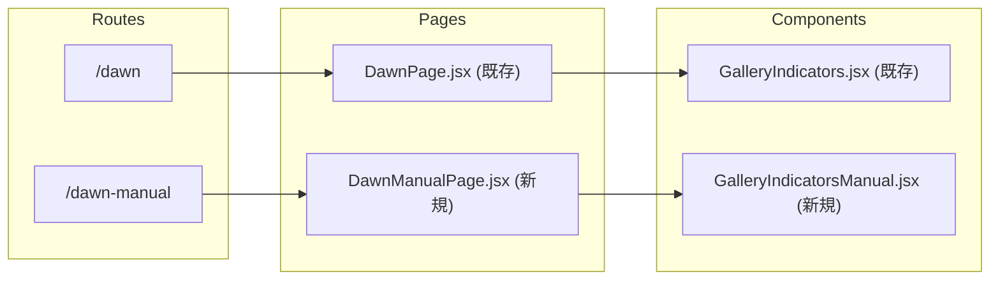

# Dawn ページ (手動版) の新規作成

## 概要
既存の `/dawn` ページを完全に保持しつつ、新しい `/dawn-manual` ルートに自動アニメーションなし・再生ボタンなしのコピーを作成します。

## 変更するファイル

### 1. 新規ファイル作成

**[src/pages/DawnManualPage.jsx](src/pages/DawnManualPage.jsx)** (新規作成)
- [DawnPage.jsx](src/pages/DawnPage.jsx) をベースにコピー
- 自動アニメーション関連のロジックを削除:
  - `isAutoAnimating`, `timerRef`, `periodStartTimeRef`, `elapsedTimeRef` 等の状態とref
  - `calculatePeriodDuration`, `handlePlayPauseClick` 等の関数
  - 自動進行の `useEffect`
- ユーザースクロールで `activePeriod` を更新するロジックは保持
- `GalleryIndicatorsManual` を使用

**[src/components/dawn/GalleryIndicatorsManual.jsx](src/components/dawn/GalleryIndicatorsManual.jsx)** (新規作成)
- [GalleryIndicators.jsx](src/components/dawn/GalleryIndicators.jsx) をベースにコピー
- `gallery-play-button` ボタンを完全に削除
- `onPlayPauseClick`, `isAutoAnimating`, `periodDuration`, `elapsedTime` propsを削除
- 進捗バーは現在のピリオドを表示するシンプルなインジケーターに変更

**[src/components/dawn/GalleryIndicatorsManual.css](src/components/dawn/GalleryIndicatorsManual.css)** (新規作成)
- [GalleryIndicators.css](src/components/dawn/GalleryIndicators.css) をベースにコピー
- `.gallery-play-button` 関連のスタイルを削除

### 2. 既存ファイルへの最小限の変更

**[src/App.jsx](src/App.jsx)** (ルート追加のみ)
- 新しいルート `/dawn-manual` を追加
- `DawnManualPage` をインポート

```jsx
import DawnManualPage from './pages/DawnManualPage'

// Routes内に追加
<Route path="/dawn-manual" element={<DawnManualPage />} />
```

## アーキテクチャ



## 動作の違い

| 機能 | /dawn (既存) | /dawn-manual (新規) |
|------|-------------|---------------------|
| 自動アニメーション | あり | なし |
| 再生/一時停止ボタン | あり | なし |
| ユーザースクロール | あり | あり |
| プログレスバー | 時間ベース | アクティブ状態のみ表示 |