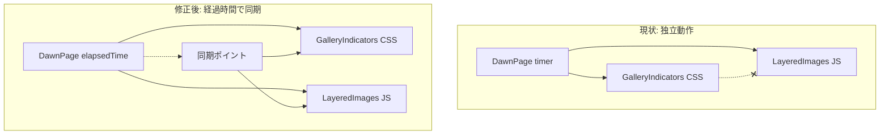

# 横スクロールとインジケーター同期の修正

## 問題の根本原因

現在、`gallery-indicator__fill`（CSS animation）と横スクロール（JS requestAnimationFrame）が**独立して動作**しているため、一時停止→再生で同期がずれる。



## 修正方針

**DawnPage の `elapsedTimeRef` を単一の真実の源（Source of Truth）とする**

- CSS animation と JS timer は両方とも `periodDuration` を使っているため、`elapsedTimeRef` = CSS animation の進捗
- 再生時、LayeredImages は `elapsedTimeRef` から期待されるスクロール位置を計算し、そこへ移動

---

## 修正内容

### 1. DawnPage.jsx - 経過時間を子コンポーネントに渡す

[src/pages/DawnPage.jsx](src/pages/DawnPage.jsx) を修正:

```javascript
// PeriodSlide に elapsedTime を渡す
<PeriodSlide
  ...
  elapsedTime={elapsedTimeRef.current}
  periodDuration={calculatePeriodDuration(index)}
/>
```

ただし `elapsedTimeRef.current` は ref なので再レンダリングされない。代わりに **state として管理** するか、再生ボタン押下時に最新値を渡す仕組みが必要。

**解決策**: 再生ボタン押下時に `syncTimestamp` state を更新し、それをトリガーに子が同期する。

### 2. PeriodSlide.jsx - 経過時間をLayeredImagesに中継

[src/components/dawn/PeriodSlide.jsx](src/components/dawn/PeriodSlide.jsx):

```javascript
<LayeredImages 
  ...
  elapsedTime={elapsedTime}
  periodDuration={periodDuration}
/>
```

### 3. LayeredImages.jsx - 核心の修正

[src/components/dawn/LayeredImages.jsx](src/components/dawn/LayeredImages.jsx):

**A. スクロール位置の計算関数を追加**

```javascript
// 経過時間からスクロール進捗を計算
const calculateScrollProgress = (elapsed, duration) => {
  const overallProgress = elapsed / duration
  if (overallProgress <= 0.2) return 0        // 開始待機
  if (overallProgress >= 0.8) return 1        // 終了待機
  return (overallProgress - 0.2) / 0.6        // 中間60%でスクロール
}
```

**B. 再生時の同期ロジック**

```javascript
// isAutoAnimating が false → true になった時
// 1. 期待されるスクロール位置を計算
// 2. 現在位置から期待位置まで滑らかに移動
// 3. その後、一定速度でスクロール続行
```

**C. 一定速度の保証**

現在のバグ: `remainingDuration` と `additionalProgress` の計算が複雑で速度が一定でない

修正: 単純に経過時間ベースで位置を計算

```javascript
const animate = () => {
  const now = Date.now()
  const totalElapsed = startElapsed + (now - animationStartTime)
  const expectedProgress = calculateScrollProgress(totalElapsed, periodDuration)
  container.scrollLeft = scrollDistance * expectedProgress
  
  if (expectedProgress < 1 && isAutoAnimatingRef.current) {
    requestAnimationFrame(animate)
  }
}
```

### 4. 同期アニメーションの実装

再生ボタン押下時、現在位置と期待位置が異なる場合:

```javascript
// 300ms かけて期待位置へ滑らかに移動
const snapToExpectedPosition = (currentPos, expectedPos, onComplete) => {
  const startTime = Date.now()
  const duration = 300
  
  const animateSnap = () => {
    const progress = Math.min((Date.now() - startTime) / duration, 1)
    const eased = 1 - Math.pow(1 - progress, 3) // ease-out
    container.scrollLeft = currentPos + (expectedPos - currentPos) * eased
    
    if (progress < 1) {
      requestAnimationFrame(animateSnap)
    } else {
      onComplete()
    }
  }
  requestAnimationFrame(animateSnap)
}
```

---

## タイムライン（修正後の動作）

```
時間軸:  0%----20%--------80%----100%
         |     |          |      |
indicator: ████████████████████████  (CSS 0→100%)
scroll:    [停止][←←←←←→→→→→][停止]  (JS 同期)

一時停止→再生時:
1. elapsedTime から期待scroll位置を計算
2. 現在位置 → 期待位置へ 300ms でアニメーション
3. その後、一定速度で継続
```

---

## 確認すべきエッジケース

1. 開始待機中（0-20%）に一時停止→再生
2. スクロール中（20-80%）に一時停止→再生  
3. 終了待機中（80-100%）に一時停止→再生
4. ユーザーが手動でスクロールを右端/左端まで動かした後に再生
5. 期間が変わるタイミング（墨摺絵→紅摺絵）での同期